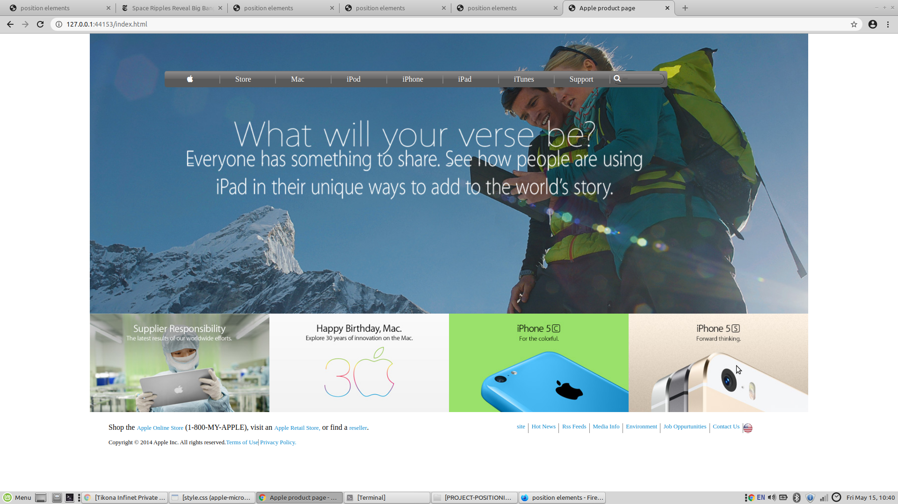

1 - apple-microverse-project# Project
​
This is an assigned project where we were supposed to replicate/clone a Apple webpage as seen in the link:

​
​
## Preview of our webpage

​

​
## Built With
- HTML5
- CSS3
- Google icons (https://www.w3schools.com/icons/icons_reference.asp)
​
## Live Demo of our project
​<a href="">click here</a>
​
## Author

​
👤 **Anand Kumar**
​
- Github: [@jamestucker1988](https://github.com/jamestucker1988)
- Twitter: [anandku74070598](https://twitter.com/anandku74070598)
- Linkedin: [Anand Kumar](https://linkedin.com/in/anand-kumar-9128)
​
## �� Contributing
​
Contributions, issues and feature requests are welcome!
​
Feel free to check the [issues page](https://github.com/jamestucker1988/Embedding-images-in-video/issues).
​
## Show your support
​
Give a ⭐️ if you like this project!
​
## Acknowledgments
- Hat tip to anyone whose code was used
- Inspiration
- etc
​
## �� License
​
This project is [MIT](lic.url) licensed.
